# Coding Fabric — Current Architecture Report

**Date:** 2026-07-05
**Scope:** full repository (`mnemonik-dev/coding-fabric`) at commit `2156623`
**Status of this document:** point-in-time review; supersedes nothing, complements `spec.md` (v0.1.1, historical) and `work/coding-fabric/tech-spec.md` (v0.2.0, approved)

---

## 1. Executive summary

The coding fabric is an **autonomous, self-hosting development loop for the Mnemonic Protocol**: a single operator issues intent from Telegram, and the system specifies, implements, reviews, QAs, and (with a veto window) merges the work — on one Tailscale-fronted Hetzner VM. The architecture has evolved significantly from the original attested spec (`spec.md` v0.1.1):

- **ruflo (claude-flow) was dropped end-to-end on 2026-05-20** — its swarm/memory/plugin features overlapped with the Molyanov skill bundle plus native Claude Code tooling; ~2,000 LOC removed.
- **Symphony** (a Kaneo-polling orchestrator embedded in the `workspace-manager` FastAPI service) replaced the originally planned ruflo swarm bridge as the dispatch engine.
- **Mnemonic attestation is descoped by default** (`mnemonic_mcp_enabled: false`); the 5-node attestation DAG is parked in the backlog feature `mnemonic-attestation-integration`. The MCP binary was re-introduced for the content-publish pipeline, but **as a per-spawn stdio process, not a daemon** (the daemon was retired 2026-06-11 after a live deploy failure).
- A second product surface, the **content-publish pipeline** (Telegram-brief → claude-written article → scored → operator-approved → published to the public `@mnemonik` channel → attested), was built on top of the fabric in June 2026 and has passed pre-deploy QA.

**Answer to "do we have information flow diagrams?": No — until this report.** The repository contained no Mermaid, PlantUML, drawio, or image diagrams anywhere. The only diagram of any kind was a single ASCII task-lifecycle sketch inside `work/coding-fabric-autonomous/architecture.md` (a draft). Section 6 of this report provides a full set of information-flow diagrams (Mermaid, rendered natively by GitHub), and §6.6 adds **PlantUML process-flow diagrams** — pre-rendered SVGs embedded below, with editable sources in [`docs/diagrams/`](diagrams/).

Overall assessment: the codebase is **well-engineered at the component level** (consistent atomic-persistence patterns, a mandatory log-sanitizer chokepoint, fail-closed guards, strong test coverage — ~7,200 test LOC across the Python services) but carries **documentation drift** (the root `spec.md` still describes the pre-ruflo-drop architecture), a handful of **stale integrations** left behind by the mnemonic-mcp daemon retirement, and the inherent **single-VM SPOF** accepted by design. Findings are in §10.

---

## 2. Documentation & diagram inventory (what existed before this report)

| Artifact | Location | State |
|---|---|---|
| Original attested spec v0.1.1 | `spec.md` | **Stale** — still describes ruflo as the substrate and mandatory attestation |
| Tech spec v0.2.0 (approved) | `work/coding-fabric/tech-spec.md` | Current for the platform; changelog records ruflo drop |
| Autonomous end-state draft | `work/coding-fabric-autonomous/architecture.md` | Draft; contains the repo's only (ASCII) diagram |
| Decision log | `work/coding-fabric/decisions.md` | 2,300+ lines, authoritative for what changed and why |
| Component READMEs | `fabric/*/README.md`, `infrastructure/ansible/roles/*/README.md` | Present for most components (content-publisher has none) |
| Information-flow / dataflow diagrams | — | **None existed** (no `.mmd`, `.puml`, `.drawio`, no embedded mermaid blocks) |

---

## 3. System context

The operator's only interface is Telegram. Everything else is a daemon or an agent on the VM, reached administratively over the Tailscale tailnet.

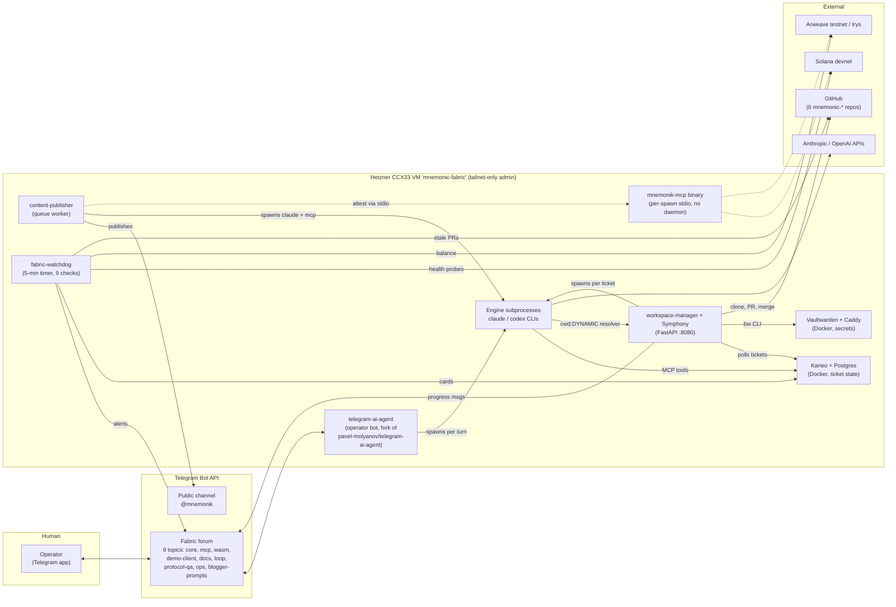

Dashed lines are **currently disabled by default** (`mnemonic_mcp_enabled: false`; attestation active only for the content-publish path, which re-enables the binary).

---

## 4. Deployment topology

Provisioning is **OpenTofu → Ansible → GitHub Actions** (cold-start path only; after bootstrap, fabric changes flow through the fabric itself — "recursive self-hosting" with a smoke-gate and last-known-good rollback anchor).

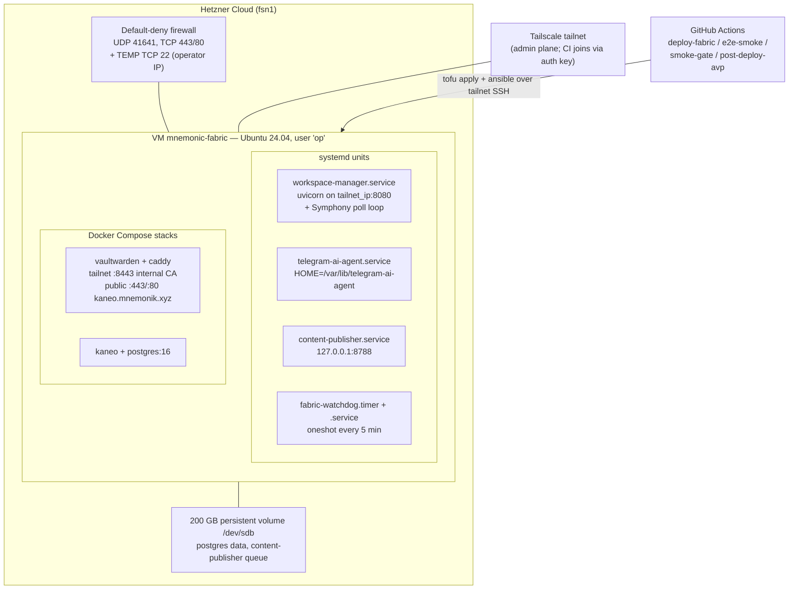

Key deployment facts:

- **Tofu** (`infrastructure/tofu/hetzner/main.tf`): persistent VM (no destroy/recreate), volume survives rebuilds, firewall default-deny. A **temporary TCP/22 rule scoped to the operator's IP** is marked for removal — it breaks the tailnet-only invariant (see finding F5).
- **Ansible** (`infrastructure/ansible/playbooks/deploy.yml`) runs 12 roles in order: base → ssh-hardening → tailscale → vaultwarden → kaneo → telegram-init → restic-backups (disabled) → molyanov → mnemonic-mcp (descoped) → fabric-services → content-publisher → telegram-ai-agent.
- **Secrets:** sops + age. One age recipient; keys on the operator laptop, in the `SOPS_AGE_KEY` GitHub secret, and on paper. Decrypted controller-side at play start, delivered to services via root-owned env files and systemd `LoadCredential`.
- **Idempotent Telegram provisioning:** the Bot API cannot list forum topics, so `telegram-init` keeps a VM-local state file (`/etc/fabric/telegram-topics.yml`) and renders `inventory/telegram-topics.yml` for downstream roles.

---

## 5. Component inventory

### 5.1 `fabric/` services (the code this repo owns)

| Component | LOC (src / tests) | Role | Key interfaces |
|---|---|---|---|
| `workspace-manager/` | ~2,600 / ~1,750 | Worktree lifecycle API **and** Symphony orchestrator | HTTP :8080 (`POST/DELETE/GET /worktree*`, `/health`); Kaneo REST; Vaultwarden `bw` CLI; git/gh; Telegram; spawns claude/codex |
| `watchdog/` | ~2,060 / ~1,600 | 9 operational checks every 5 min; `/turn-into-task` | Telegram ops topic; Kaneo cards; Solana/Irys/GitHub probes; SSRF-guarded (allowlisted public hosts) |
| `logs/sanitizer/` | ~360 / ~570 | Mandatory secret-redaction chokepoint (base58 keys, JWK, API tokens, TG file URLs) | Pure library; hard dependency of watchdog, wired into workspace-manager logging |
| `content-publisher/` | ~2,480 / ~3,330 | Blog pipeline: queue + 13-state job machine + CAS; spawn/score/preview/publish/attest | `queue.jsonl` on persistent volume; spawns claude; `mnemonik_blogger` in-process; `mnemonik-mcp mcp-stdio` for attestation |
| `safe-mode/` | shell | `last-known-good` tag hook; docker-compose smoke gate; rollback playbook counterpart | git tags, flock locks, workspace-manager API |
| `harnesses/` | ~820 | 4 conformance harnesses by PR `task_type`: byte-equivalence (Rust/TS/WASM CBOR), mcp-compat, wasm-browser (Playwright), full-mode (devnet/Arweave round-trip, mainnet-refusal) | Stub-mode by default; real integration opt-in via env |
| `github-templates/` | YAML/MD | PR template (4 mandatory sections) + `pr-conformance.yml` (500-line diff cap, task_type dispatch) | Deployed into the 6 mnemonic-* repos |

Shared engineering pattern across all three stateful services: **flock + tempfile + `os.replace` + dir-fsync** atomic persistence, deliberately duplicated so each service deploys independently.

### 5.2 Orchestration & methodology layer

- **Symphony config (`.symphony/`)** — three stages as workflow prompts with YAML front-matter: `code.md` (engine **claude**), `review.md` (engine **codex**, read-only tools — deliberate cross-engine adversarial review), `qa.md` (engine **claude** + Playwright MCP). `policy.yml`: `merge_policy: auto-with-veto`, 24 h veto window, `/reject` in the ops topic cancels.
- **Molyanov skill bundle** (`infrastructure/ansible/files/claude-skills/`, vendored; synced by `scripts/sync-skills.sh`) — 18 skills + 9 commands enforcing the pipeline *idea → user-spec → tech-spec → task decomposition → TDD implementation → audits → QA → deploy*. Shipped to every claude spawn site (bot HOME and `op` HOME).

### 5.3 CI workflows (`.github/workflows/`)

| Workflow | Trigger | What it does |
|---|---|---|
| `deploy-fabric.yml` | tag `fabric-v*` / manual | tofu plan/apply → runner joins tailnet → Ansible deploy → e2e-smoke (best-effort, `continue-on-error`) → Telegram notify |
| `smoke-gate.yml` | PR touching `fabric/**`, ansible | 15-min budget: candidate fabric in docker-compose runs a trivial docs task end-to-end; **required status check** on the loop branch |
| `e2e-smoke.yml` | reusable/dispatch | Runner joins tailnet, SSHes to VM, sends a synthetic `/do-feature` via the docs topic, verifies worktree cleanup via `GET :8080/worktrees`; DAG/attestation steps gated off by default |
| `post-deploy-avp.yml` | dispatch | 9 AVP validation steps on the VM + deliberate-break rollback drill + first recursive self-merge + report artifact |

---

## 6. Information flow diagrams

### 6.1 Autonomous task lifecycle (the core loop)

```mermaid
sequenceDiagram
    autonumber
    actor Op as Operator (Telegram)
    participant Bot as telegram-ai-agent
    participant K as Kaneo (tickets = durable state)
    participant Sym as Symphony (in workspace-manager)
    participant Eng as Engine subprocess (claude/codex)
    participant GH as GitHub

    Op->>Bot: intent in a repo topic ("do X in core")
    Bot->>Eng: spawn claude for the turn (cwd resolved via workspace-manager)
    Eng->>K: create_task via Kaneo MCP (label stage:code)
    loop every 30 s
        Sym->>K: list active tickets (to-do … ready-to-merge)
    end
    Sym->>Sym: stage from label -> load .symphony/workflows/code.md
    Sym->>Sym: lease workspace ~/code/symphony-workspaces/TASK-ID
    Sym->>Eng: spawn engine from workflow front-matter (claude, max 3 concurrent)
    Eng->>GH: implement TDD, open PR "feat(...): closes TASK-ID"
    Eng->>K: comment + transition ticket to review
    Sym->>Eng: review stage — codex, read-only tools (cross-engine)
    Eng->>K: findings; approve -> qa | changes-requested -> stays review
    Sym->>Eng: qa stage — claude + Playwright (30-min budget)
    Eng->>K: pass -> ready-to-merge | fail -> review + qa-fail
    Sym->>Bot: post veto notice to ops topic
    Note over Sym,K: 24 h veto window — deadline persisted as a Kaneo comment
    alt operator sends /reject
        Sym->>K: ticket -> review (cancelled)
    else window expires
        Sym->>GH: gh pr merge --squash
        Sym->>K: ticket -> done
    end
```

Durability model: **Kaneo is the only persistent orchestration state.** Symphony's in-memory queue is rebuilt from active tickets on restart; the veto deadline is re-read from a ticket comment on every tick, so a Symphony restart cannot lose the window.

### 6.2 Worktree provisioning & secrets materialisation

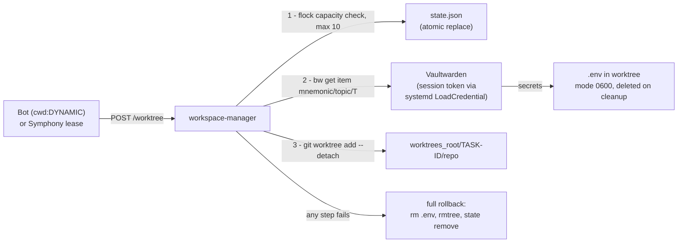

### 6.3 Content-publish pipeline (June 2026 addition)

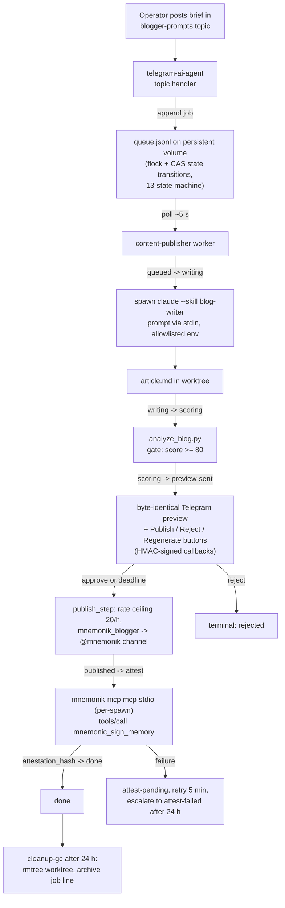

Isolation decisions worth noting: the pipeline **deliberately owns its own JSONL queue** (no Kaneo/Symphony coupling, no shared-state races); the **publisher bot token is separate** from the operator bot; auto-publish mode requires a **two-location constant-time HMAC token match** or the service exits at boot.

### 6.4 Deploy, recovery, and self-hosting flow

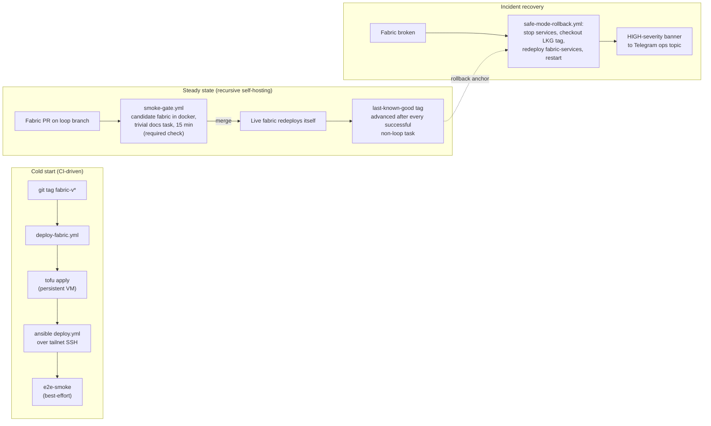

### 6.5 Observability / watchdog flow

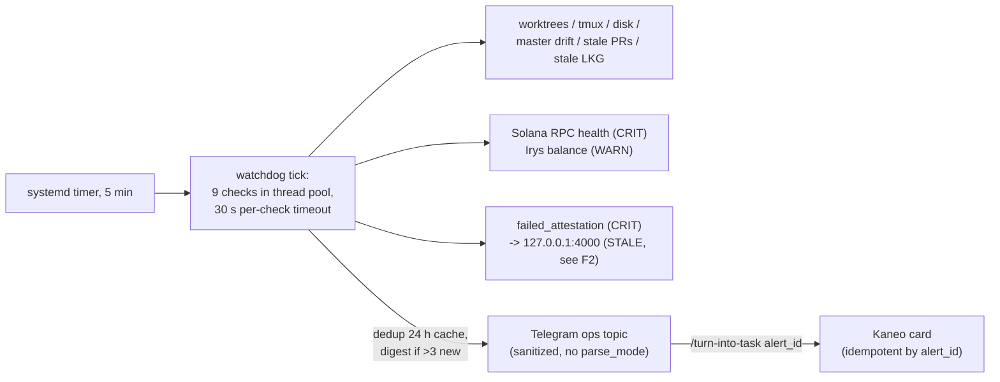

### 6.6 PlantUML process flow diagrams

The diagrams below are the PlantUML companion set to §6.1–6.5, with two additions that Mermaid renders poorly: the **content-publisher job state machine** (taken verbatim from `models.py::allowed_transitions`) and the **auto-merge veto process**. Each SVG is pre-rendered and committed; the editable `.puml` sources live in [`docs/diagrams/`](diagrams/). To re-render after editing:

```bash
plantuml -tsvg docs/diagrams/*.puml   # requires graphviz for the component/state diagrams
```

#### 6.6.1 System context (component view)

[Source](diagrams/system-context.puml)

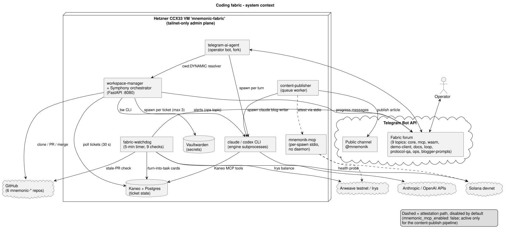

#### 6.6.2 Autonomous task lifecycle (sequence)

[Source](diagrams/task-lifecycle.puml)

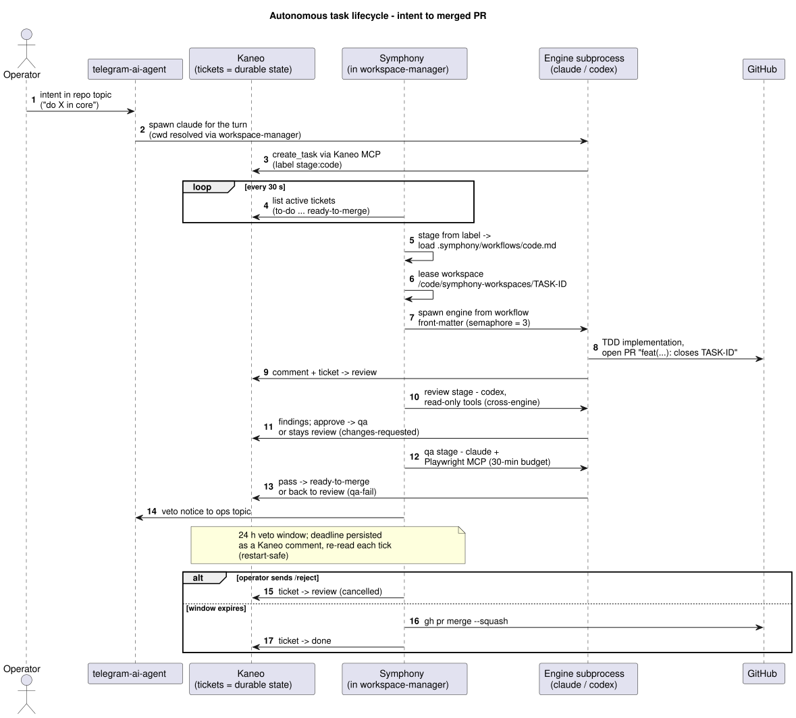

#### 6.6.3 Worktree provisioning with rollback (activity)

[Source](diagrams/worktree-provisioning.puml)

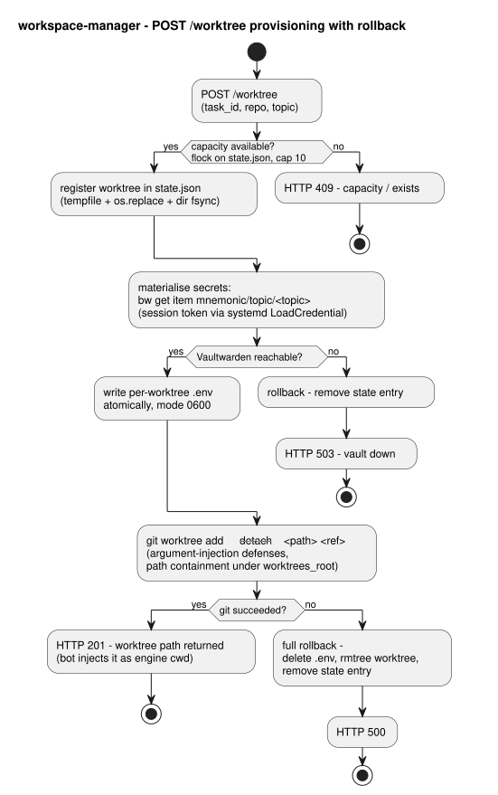

#### 6.6.4 Content-publish process (activity, swimlanes)

[Source](diagrams/content-publish-process.puml)

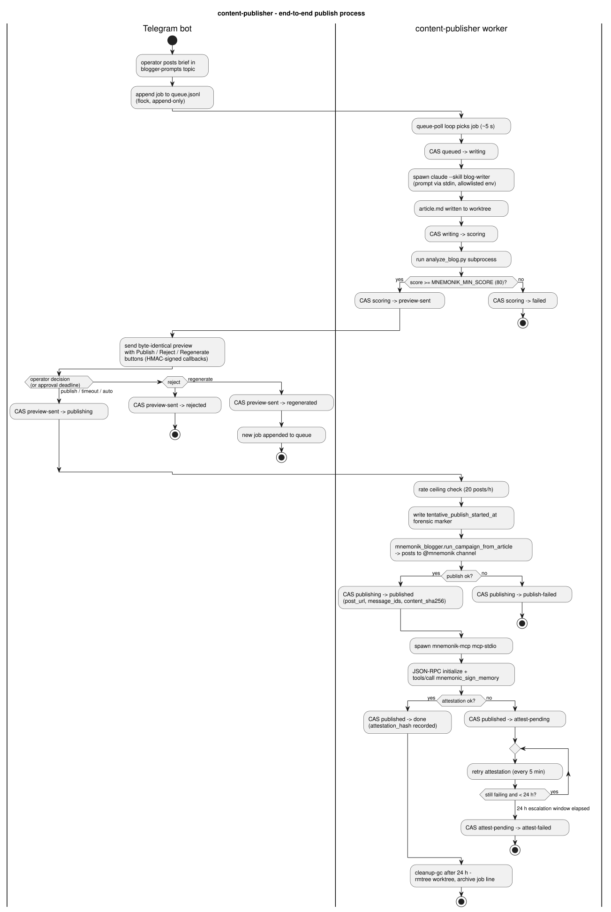

#### 6.6.5 Content-publisher job state machine (state)

Transitions mirror `fabric/content-publisher/src/content_publisher/models.py` exactly; dashed edges are the boot-recovery resets applied by `recovery.py` outside the CAS graph.

[Source](diagrams/content-publisher-job-states.puml)

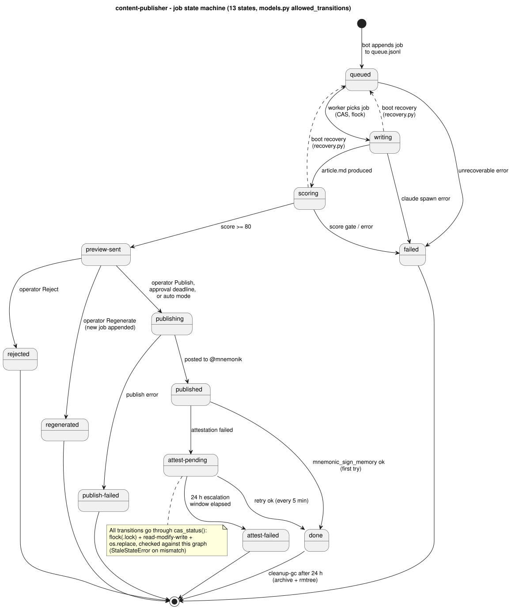

#### 6.6.6 Auto-merge veto window (activity)

[Source](diagrams/auto-merge-veto.puml)

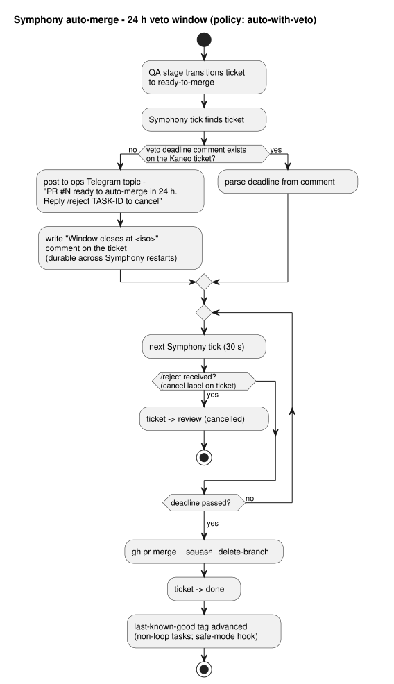

#### 6.6.7 Deploy, self-hosting and incident recovery (activity, swimlanes)

[Source](diagrams/deploy-recovery.puml)

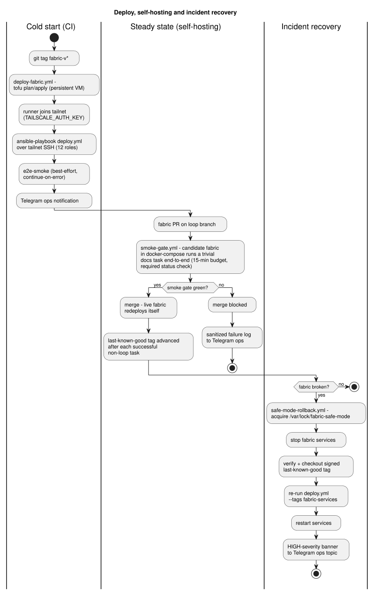

#### 6.6.8 Watchdog tick (activity, fork/join)

[Source](diagrams/watchdog-tick.puml)

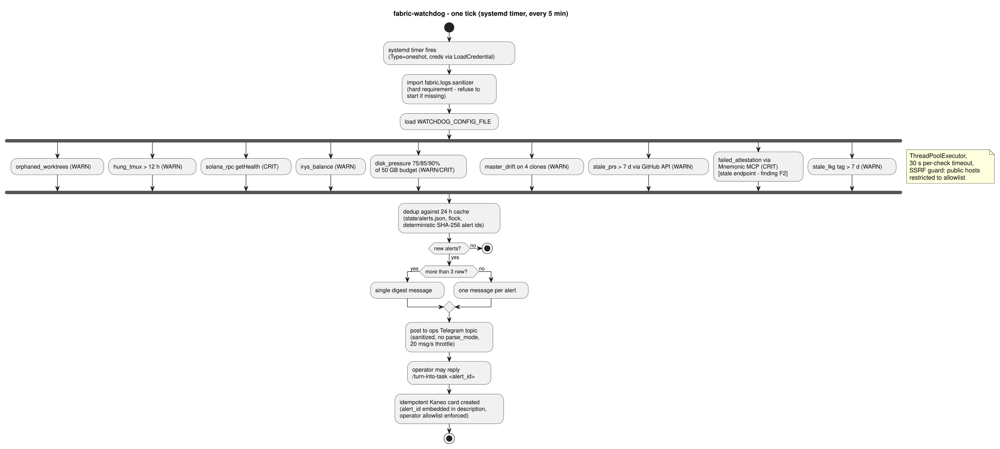

---

## 7. Data & state stores

| Store | Owner | Purpose | Durability |
|---|---|---|---|
| Kaneo Postgres | Kaneo (Docker) | Tickets, comments — **the orchestration source of truth** | Persistent volume (symlinked) |
| `~/.fabric/workspace-manager/state.json` | workspace-manager | Worktree registry + capacity gate | Atomic replace, flock |
| `/var/lib/content-publisher/queue.jsonl` (+ `.archive.jsonl`) | content-publisher | Job queue & 13-state machine | Persistent volume, CAS |
| `~/.fabric/watchdog/state/alerts.json` | watchdog | 24 h alert dedup cache | Atomic replace, flock |
| `/etc/fabric/telegram-topics.yml` | telegram-init | Forum-topic idempotency (Bot API can't list topics) | VM-local |
| `last-known-good` git tag | safe-mode | Rollback anchor for the loop repo | GitHub (force-with-lease) |
| Vaultwarden | Docker | Long-term credentials, per-topic secret items | Persistent volume |
| Restic → Hetzner Storage Box | restic-backups role | Off-site nightly backups | **Disabled by default** (F7) |

---

## 8. Security architecture

- **Network:** default-deny firewall; admin plane is tailnet-only (except the TEMP SSH rule, F5); the only public surfaces are Caddy :443/:80 for the Kaneo UI and the Telegram Bot API long-poll (outbound).
- **Secrets:** sops/age at rest in git; runtime delivery via root-owned env files and systemd `LoadCredential` (the Vaultwarden session token never touches an env var); per-worktree `.env` files are 0600 and deleted on cleanup; child-process environments are built from **allowlists** (`restricted_env`) so parent secrets can't leak into spawned agents.
- **Log hygiene:** every log line and outbound Telegram message passes the sanitizer (base58 keys, JWK fragments, `sk-`/`api_`/`ANTHROPIC_*` tokens, TG file URLs); the watchdog refuses to start without it.
- **Fail-closed guards:** pk-guard hook (rejects writes to Project Knowledge references without explicit bypass, bypass logged to ops); watchdog SSRF allowlist rejects mainnet endpoints; full-mode harness has a mainnet-refusal allowlist; auto-publish requires the dual HMAC token; git worktree calls defend against argument injection.
- **Agent containment:** engines run with broad permissions (`--permission-mode bypassPermissions`) but inside per-task worktrees, with no Vaultwarden access, no push-to-main (branch protection + smoke gate), and merges only through the veto-windowed auto-merge path.
- **Audit posture:** security/code/test audits (Tasks 20–22) all initially returned *needs-remediation* (17 security findings) and were remediated; pre-deploy QA (Task 23) passed with zero blockers.

---

## 9. Current status: built vs deployed vs deferred

| Category | Items |
|---|---|
| **Built & QA-passed** | All platform roles and services (Tasks 01–09, 11–13, 16–25 of the v0.2.0 plan); content-publish pipeline Tasks 1–12 (198 tests green, pre-deploy verdict `proceed_to_deploy`) |
| **Live** | A real deploy pipeline has run against the VM (deploy run 27321103516 surfaced and fixed the mnemonic-mcp daemon crash); bot, workspace-manager, Kaneo, Vaultwarden operational per debug handoff notes |
| **In flight** | Content-publish deploy (T13) and post-deploy verification (T14) still `planned`; bootstrap checklists in-repo are entirely unchecked (F8) |
| **Deferred (backlog)** | 5-node Mnemonic attestation DAG (`mnemonic-attestation-integration`, waiting on MCP v1.0+); `cwd:DYNAMIC` upstream PR (`mnemonic-tg-bridge` — superseded by own-the-fork strategy) |
| **Dropped** | ruflo end-to-end (2026-05-20): role, swarm bridge, validator wrappers, per-topic toggle matrix, stale-swarms check |

---

## 10. Architecture review — findings & recommendations

Ordered by severity. None are release blockers; F1–F3 are the ones worth scheduling.

**F1 — Root `spec.md` is misleading (doc drift).** It still presents ruflo as the substrate, mandatory attestation, and the 8×6 topic matrix — all changed or dropped since. Anyone (human or agent) bootstrapping from the repo root gets the wrong architecture. *Recommendation:* add a banner at the top of `spec.md` pointing to `work/coding-fabric/tech-spec.md` v0.2.0 and this report, or move it to `work/coding-fabric/archive/`. (Note `.symphony/README.md`/`architecture.md` also still reference `kaneo.mnemonic-fabric.ts` vs the deployed `kaneo.mnemonik.xyz`.)

**F2 — Stale attestation check in the watchdog.** `fabric/watchdog/checks/failed_attestation.py` defaults to POSTing `http://127.0.0.1:4000` — the mnemonic-mcp **daemon** endpoint that was retired on 2026-06-11 in favour of per-spawn stdio. When attestation is re-enabled, this CRIT-severity check will either false-alarm or silently fail; the check's own config refuses to be disabled without `acknowledge_disable_consequences=true`, which makes the stale default worse. *Recommendation:* rewrite the check to spawn `mnemonik-mcp mcp-stdio` and call `mnemonic_check_pending` over stdio (mirroring `content_publisher/mcp_client.py`), or gate it on `mnemonic_mcp_enabled`.

**F3 — ~5,100 `node_modules` files committed to git** (under `fabric/harnesses/byte-equivalence/ts/`). This bloats the repo, pollutes searches (this review had to filter them constantly), and creates supply-chain review noise. The harness already has a lockfile-based build. *Recommendation:* `git rm -r --cached` the directory, extend `.gitignore`, and let the harness `Makefile`/CI install dependencies.

**F4 — Kaneo TLS verification disabled** (`fabric/workspace-manager/kaneo_client.py:73`, `ssl.CERT_NONE`) because Kaneo sits behind Caddy's internal CA on the tailnet. Tailnet encryption limits the practical exposure, but the pattern invites copy-paste into less protected contexts. *Recommendation:* distribute the Caddy internal CA root to the VM trust store (the infrastructure already manages Caddy) and verify against it.

**F5 — TEMP public SSH rule still in Tofu** (`infrastructure/tofu/hetzner/main.tf`, TCP/22 from the operator IP, self-marked for removal; also flagged in the 2026-05-23 debug handoff backlog). It breaks the tailnet-only admin invariant. *Recommendation:* remove now that CI SSH-over-tailnet is proven green.

**F6 — Veto-window state as a parsed Kaneo comment.** The auto-merge deadline is persisted by writing "Window closes at `<iso>`" into a ticket comment and regex-reading it back each tick. It's restart-safe (good) but fragile against comment edits, localisation, or Kaneo API changes, and it's load-bearing for the *merge-without-human* path. *Recommendation:* move to a structured field (Kaneo custom field or label like `merge-at:<epoch>`), keeping the comment as human-readable mirror.

**F7 — Backups and attestation are both off by default.** `restic_backups_enabled: false` (Storage Box key pending) plus the accepted single-VM design means the durable state (Kaneo Postgres, content queue, Vaultwarden) currently has **no off-site copy**; the persistent volume survives VM rebuilds but not project/account-level loss. *Recommendation:* finish the Storage Box bootstrap step and flip the flag before scaling usage; this is the cheapest resilience win available.

**F8 — Process bookkeeping gaps.** Tasks 24/25 are marked `done` with no decisions.md write-up; content-publish Tasks 12–14 frontmatter says `planned` while the decision log shows T12 done; both bootstrap checklists are entirely unchecked despite live deploys. Harmless individually, but this repo's methodology treats these files as the audit trail — and the attestation layer that would otherwise notarise progress is the part that's deferred. *Recommendation:* one cleanup pass to reconcile statuses; consider making `/done` refuse to close a task without a decisions.md entry.

**F9 (observation, not a defect) — `workspace-manager` now carries two architectures.** The legacy worktree-API role (bot `cwd:DYNAMIC` resolver, Vaultwarden coupling) and Symphony coexist in one service. `work/coding-fabric-autonomous/architecture.md` §7 already plans to demote the legacy endpoints and drop the hard `materialise_env` coupling from the lease path — that decommission is still pending. Worth doing before the next feature lands on the service, while the seam is still clean.

---

## Appendix A — Repository map

```
coding-fabric/
├── spec.md                      # original attested spec v0.1.1 (historical — see F1)
├── docs/                        # this report + diagrams/ (PlantUML sources + rendered SVGs)
├── fabric/                      # the services layer (§5.1)
│   ├── workspace-manager/       # worktree API + Symphony orchestrator
│   ├── watchdog/                # 9-check ops daemon
│   ├── logs/sanitizer/          # secret-redaction library
│   ├── content-publisher/       # blog pipeline worker
│   ├── safe-mode/               # LKG tag, smoke gate, rollback
│   ├── harnesses/               # 4 conformance harnesses
│   └── github-templates/        # PR template + pr-conformance CI
├── infrastructure/
│   ├── tofu/hetzner/            # VM, volume, firewall
│   ├── ansible/                 # 12 roles + deploy/rollback playbooks
│   │   └── files/claude-skills/ # vendored Molyanov methodology bundle
│   └── secrets/                 # sops/age-encrypted secrets
├── .symphony/                   # stage workflows (code/review/qa) + merge policy
├── .github/workflows/           # deploy-fabric, smoke-gate, e2e-smoke, post-deploy-avp
├── scripts/                     # sync-skills, pair-kaneo, e2e smoke, AVP steps
└── work/                        # methodology artifacts: specs, tasks, decisions
    ├── coding-fabric/           # platform v0.2.0 (approved) + archive/v0.1.1
    ├── coding-fabric-autonomous/# end-state draft (had the only prior diagram)
    ├── content-publish-pipeline/# blog pipeline feature (T1–12 done)
    ├── mnemonic-tg-bridge/      # cwd:DYNAMIC fork strategy
    └── mnemonic-attestation-integration/  # backlog: restore attestation DAG
```
