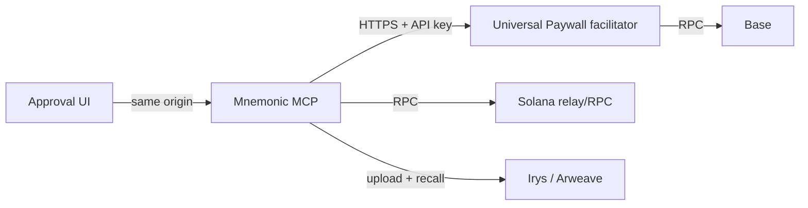

# Universal Paywall staging stack

This directory is the deployment contract for the Phase-1, exact-payment
facilitator used by Mnemonic anchoring. It is deliberately an isolated stack:

- directory: `/opt/universal-paywall-staging`
- Compose project: `universal-paywall-staging`
- network: Base Sepolia (`CHAIN_ID=84532`) only
- listener: `127.0.0.1:8403` only
- durable state: the stack's own `facilitator-payment-store` volume

It must not reuse `/opt/mnemonik-server`, its environment file, or any of its
volumes. This stack deploys a separately staged Mnemonic MCP, its same-origin
approval UI assets, and the Paywall facilitator.

## Placement model

The Compose file is a convenient *co-located staging topology*, not an
assumption in the product protocol. The durable boundaries are HTTP and signed
receipts:



`UNIVERSAL_PAYWALL_URL` is the MCP-to-facilitator location contract. It is
`http://facilitator:8403` only for this local Docker topology. A split
deployment sets it to the facilitator's private HTTPS/Tailscale endpoint in
SOPS. The MCP, facilitator, and UI may therefore move independently without
changing operation bindings, approvals, receipt verification, or recovery.

The approval UI must remain **same-origin** with the MCP API because it uses
the one-purpose browser resume capability and does not receive a facilitator
credential. That is a routing constraint, not a host constraint: it may be
served by a distinct static host/CDN behind the MCP's approved reverse-proxy
origin.

## One-time operator bootstrap

Before the first `apply`, provision the following files through the repository
SOPS/Ansible secret path, never by committing plaintext:

```text
/opt/universal-paywall-staging/.env                         mode 0600
/opt/universal-paywall-staging/secrets/receipt-private-key.pem  mode 0600, uid 10001
/opt/universal-paywall-staging/secrets/mnemonic-id.json         mode 0600, uid 10001
```

Use [`.env.example`](.env.example) as a key-only guide. The deploy workflow
requires `CHAIN_ID=84532`, `NETWORK=base-sepolia`, and
`EXACT_PAYMENTS_ENABLED=1`; it rejects Base mainnet and mutable image tags.

Also create the GitHub Environment `paywall-staging`, configure required
reviewers, and scope `TAILSCALE_AUTH_KEY` and `CI_SSH_PRIVATE_KEY` to it.
This prevents a normal repository workflow from silently reaching the VPS.

First render these files using the Fabric `universal-paywall-staging` Ansible
role (fed by `infrastructure/secrets/secrets.sops.yml`). The release workflow
then preserves them and changes only reviewed immutable image references.

## Release procedure

1. Publish facilitator and approval-UI images from Universal Paywall, and use
   immutable SHA tags for both. Select a reviewed immutable MCP image too;
   never use `latest` or `staging`.
2. Run `deploy-paywall-staging` with `action=diagnose` to check the remote
   secret file modes, container state, and image without changing anything.
3. After environment approval, run `action=apply` with all three immutable
   image references. The workflow installs only its compose/Caddy contracts,
   preserves the secret `.env`, checks the Base Sepolia/exact-only invariants,
   and waits for MCP `/health` inside the container.
4. A rollback is a fresh approved dispatch using the previous immutable image
   reference. It does not delete the payment-store volume; preserving it is
   required for exact-payment receipt and retry safety.

The CI job does not create testnet credentials, fund wallets, or migrate this
stack to Base mainnet. Those are separate, reviewed operational actions.
