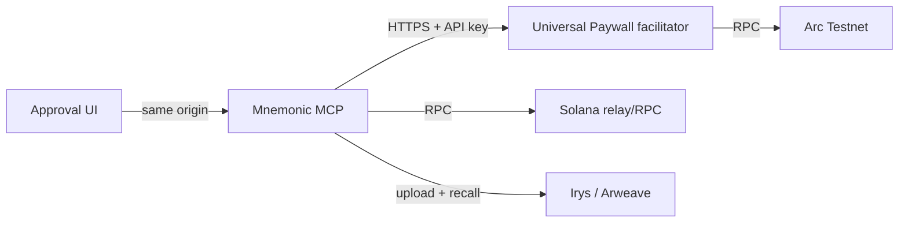

# Universal Paywall staging stack

This directory is the deployment contract for the Phase-1, exact-payment
facilitator used by Mnemonic anchoring. It is deliberately an isolated stack:

- directory: `/opt/universal-paywall-staging`
- Compose project: `universal-paywall-staging`
- network: Arc Testnet (`CHAIN_ID=5042002`) only
- listener: `127.0.0.1:8403` only
- durable state: the stack's own `facilitator-payment-store` volume

It must not reuse `/opt/mnemonik-server`, its environment file, or any of its
volumes. This stack deploys a separately staged Mnemonic MCP, its same-origin
approval UI assets, and the Paywall facilitator.

## Placement model

The Compose file is a convenient *co-located staging topology*, not an
assumption in the product protocol. The durable boundaries are HTTP and signed
receipts:



`UNIVERSAL_PAYWALL_URL` is the MCP-to-facilitator location contract. It is
`http://facilitator:8403` only for this local Docker topology. A split
deployment sets it to the facilitator's private HTTPS/Tailscale endpoint in
SOPS. The MCP, facilitator, and UI may therefore move independently without
changing operation bindings, approvals, receipt verification, or recovery.

The approval UI must remain **same-origin** with the MCP API because it uses
the one-purpose browser resume capability and does not receive a facilitator
credential. That is a routing constraint, not a host constraint: it may be
served by a distinct static host/CDN behind the MCP's approved reverse-proxy
origin.

## One-time operator bootstrap

Before the first `apply`, provision the following files through the repository
SOPS/Ansible secret path, never by committing plaintext:

```text
/opt/universal-paywall-staging/.env                         mode 0600
/opt/universal-paywall-staging/secrets/receipt-private-key.pem  mode 0600, uid 10001
/opt/universal-paywall-staging/secrets/mnemonic-id.json         mode 0600, uid 10001
```

Use [`.env.example`](.env.example) as a key-only guide. The deploy workflow
requires `CHAIN_ID=5042002`, `NETWORK=arc-testnet`, and
`EXACT_PAYMENTS_ENABLED=1`; it rejects production networks and mutable image
tags.

Also create the GitHub Environment `paywall-staging`, configure required
reviewers, and scope `TAILSCALE_AUTH_KEY` and `CI_SSH_PRIVATE_KEY` to it.
This prevents a normal repository workflow from silently reaching the VPS.

First render these files using the Fabric `universal-paywall-staging` Ansible
role (fed by `infrastructure/secrets/secrets.sops.yml`). The release workflow
then preserves them and changes only reviewed immutable image references.

## Arc Testnet payment preflight

Every deployment runs [`verify-arc-testnet.mjs`](verify-arc-testnet.mjs)
before it contacts the VPS. It verifies the public RPC chain ID, the deployed
USDC ERC-20 interface, and the EIP-712 domain/EIP-3009 authorization-state
surface required by exact payments. It uses bounded retries for public-RPC
rate limits. A failed preflight is a deployment stop, not a warning.

The Arc native gas balance uses 18-decimal precision, while its USDC ERC-20
interface uses 6 decimals. The facilitator and MCP payment asset are the
ERC-20 interface; do not substitute the native-gas representation.

## Operator-supplied inputs

Add these only through SOPS or the protected GitHub Environment, never in a
commit or chat message:

| Location | Field | Operator action |
| --- | --- | --- |
| SOPS staging secret | `universal_paywall_staging_facilitator_key` | Create a dedicated Arc Testnet wallet, fund it with faucet USDC, and enter its private key through `sops`. |
| SOPS staging secret | `universal_paywall_staging_pay_to` | Enter the dedicated staging payout wallet address. |
| Reviewed Ansible configuration | `universal_paywall_staging_domain` | Confirm the public MCP hostname that resolves to the VPS. |
| GitHub Environment `paywall-staging` | `TAILSCALE_AUTH_KEY` | Add an ephemeral/reusable key permitted to join the deployment runner to the tailnet. |
| GitHub Environment `paywall-staging` | `CI_SSH_PRIVATE_KEY` | Add the deployment-account key only if this environment does not already contain it. |

The service API key, receipt key, MCP JWT secret, refresh salt, and Mnemonic
identity key are generated as staging-only secrets during the SOPS bootstrap.

## External E2E credentials

The external E2E runner is a separate trust boundary from the VM. Its
staging-only OAuth bearer token and funded Arc Testnet test-wallet key belong
in a protected GitHub Environment or equivalent CI secret manager—not in the
VM `.env`, SOPS receipt key, or MCP database. The runner consumes the
following `e2e/.env.staging.example` values at dispatch time:

- `E2E_STAGING_MCP_BEARER_TOKEN`: short-lived token for a dedicated E2E MCP
  subject, with no production access.
- `E2E_STAGING_PAYER_PRIVATE_KEY`: funded test-USDC wallet, used through a
  quote-restricted Node-side signer and never injected into the approval page.
- endpoint, asset, payee, relay-path, and Irys values: non-secret deployment
  identities needed by the fail-closed preflight.

The workflow runner must have private network access to the facilitator health
endpoint (for example Tailscale). It must not receive the facilitator key,
receipt private key, Mnemonic identity keypair, or SOPS age key. Rotate the
test wallet and revoke the E2E OAuth token after any runner or secret-manager
incident.

## Release procedure

1. Publish facilitator and approval-UI images from Universal Paywall, then use
   their immutable `@sha256:` digest references. Select a reviewed immutable
   MCP digest too; tags such as `latest`, `staging`, and `sha-…` are not
   accepted by the deployment gate because tags can be moved after approval.
2. Run `deploy-paywall-staging` with `action=diagnose` to check the remote
   secret file modes, container state, and image without changing anything.
3. After environment approval, run `action=apply` with all three immutable
   image references. The workflow installs only its compose/Caddy contracts,
   preserves the secret `.env`, verifies Arc's USDC EIP-712/EIP-3009 surface,
   checks the Arc Testnet/exact-only invariants,
   and waits for both MCP and facilitator health inside their containers.
4. A rollback is a fresh approved dispatch using the previous immutable image
   reference. It does not delete the payment-store volume; preserving it is
   required for exact-payment receipt and retry safety.

The CI job does not create testnet credentials, fund wallets, or migrate this
stack to a production network. Those are separate, reviewed operational actions.
